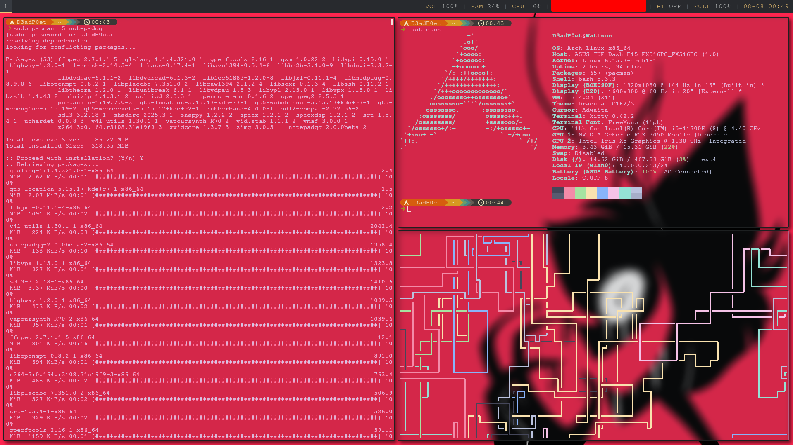

# Arch Linux Dotfiles

This repository contains my personal dotfiles and configuration for an Arch Linux setup. It includes a minimal and functional desktop environment centered around the i3 window manager, customized terminal experience, and essential utilities for daily use.

---

## Screenshot of my RICE



---
## Features & Tools

These dotfiles cover configuration for the following tools and components:

- **Window Manager**: i3
- **Terminal Emulator**: kitty  
- **Shell**: fish
- **Prompt**: starship
- **Screenshot Tool**: flameshot
- **Application Launcher**: rofi
- **Panel/Bar**: polybar
- **Compositor**: picom
- **Wallpaper Setter**: nitrogen
- **Volume Control**: pulse / pulsemixer
- **File Manager**: Thunar
- **Settings Backend**: dconf
- **Desktop Environment Components**: xfce4 (optional usage)
- **Notes**: zim
- **Network Manager**: NetworkManager

---

## Directory Structure

```
.
├── .config/
│   ├── dconf/
│   ├── fish/
│   ├── flameshot/
│   ├── i3/
│   │   └── scripts/
│   ├── kitty/
│   ├── nitrogen/
│   ├── picom/
│   ├── polybar/
│   ├── rofi/
│   └── starship.toml
├── .pulse/
├── .zim/
└── README.md
```

---

## Installation

> ⚠️ **Note**: These dotfiles are not yet managed with `stow` or `chezmoi`, so manual copying or linking is required.

### 1. Clone the repository

```bash
git clone https://github.com/d3adp0et/dotfiles.git
cd dotfiles
```

### 2. Copy or link the configuration

**Option A: Copy configs into place**

```bash
cp -r dotfiles/.config/* ~/.config/
cp -r dotfiles/.pulse/* ~/.pulse/
cp -r dotfiles/.zim/* ~/.zim/
```

**Option B: Create symbolic links**

```bash
ln -s ~/dotfiles/.config/i3 ~/.config/i3
ln -s ~/dotfiles/.config/kitty ~/.config/kitty
ln -s ~/dotfiles/.config/fish ~/.config/fish
ln -s ~/dotfiles/.config/polybar ~/.config/polybar
ln -s ~/dotfiles/.config/rofi ~/.config/rofi
ln -s ~/dotfiles/.config/picom ~/.config/picom
ln -s ~/dotfiles/.config/flameshot ~/.config/flameshot
ln -s ~/dotfiles/.config/nitrogen ~/.config/nitrogen
ln -s ~/dotfiles/.config/dconf ~/.config/dconf
ln -s ~/dotfiles/.config/starship.toml ~/.config/starship.toml
ln -s ~/dotfiles/.pulse ~/.pulse
ln -s ~/dotfiles/.zim ~/.zim
```

### 3. Install required packages

Make sure necessary packages are installed using `pacman` or `yay`:

```bash
# Core packages
sudo pacman -S i3-wm kitty fish starship rofi polybar picom nitrogen thunar dconf

# Additional packages
sudo pacman -S flameshot pulsemixer

# AUR packages (using yay)
yay -S zim
```

---

## Notes

- These configurations assume you're using Arch Linux with X11
- Some configs may expect specific fonts, themes, or icon sets to be installed
- Feel free to adapt or fork these files for your own setup
- Consider using a dotfile manager like `stow` or `chezmoi` for easier management

---

## TODO

- [ ] Implement dotfile management with `stow` or `chezmoi`
- [ ] Add installation script
- [ ] Include font and theme dependencies
- [ ] Document keybindings and customizations

---

## License

This project is licensed under the MIT License. See the [LICENSE](LICENSE) file for details.

---

## Contributing

Feel free to open issues or submit pull requests if you have suggestions for improvements!

---

## Acknowledgments

- The Arch Linux community for excellent documentation
- r/unixporn for inspiration
- All the developers of the tools configured in these dotfiles
